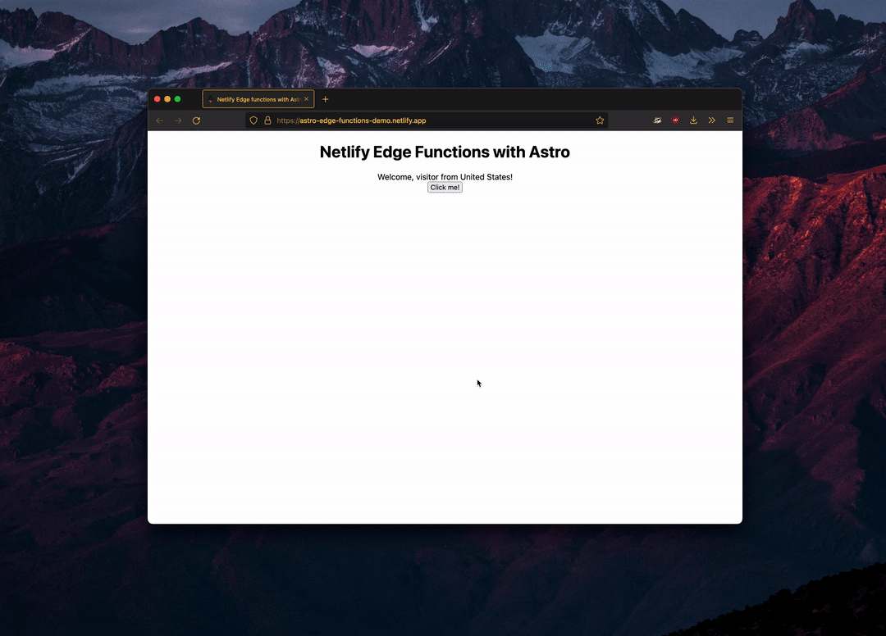

# Using Netlify Edge Functions with Astro

A starter template for building a Server-Side Rendered (SSR) [Astro](https://astro.build/) app with [Netlify Edge Functions](https://docs.netlify.com/netlify-labs/experimental-features/edge-functions/).

[](https://app.netlify.com/start/deploy?repository=https://github.com/sarahetter/astro-netlify-edge-starter)

This demo uses Astro's [`@astrojs/netlify`](https://github.com/withastro/astro/tree/main/packages/integrations/netlify) package to deploy your site with SSR enabled. The application will detect the location of the user requesting the page and will render it in the browser.

### Demo site

Visit https://astro-edge-functions-demo.netlify.app/ to see the code in this repository in action.



### Local development

To get started with local development, follow the instructions below in your terminal application.

1. Clone this repository locally:

    ```bash
    git clone https://github.com/sarahetter/astro-netlify-edge-starter
    ```
2. Navigate to the repository folder:

    ```bash
    cd astro-netlify-edge-starter
    ```
3. Install the package dependencies:

    ```bash
    npm install
    ```

4. Start the application:

    ```bash
    npm run dev
    ```

If the command was successful, you should be able to get a local URL that you can open in your browser.


Keep in mind that because you are running the application locally, the geolocation component will not work. Once you deploy the application to Netlify, the location should be correctly identified.

### Deploying the project to Netlify

To deploy the project to Netlify, make sure that you have the [Netlify CLI](https://docs.netlify.com/cli/get-started/) installed. You can install the Netlify CLI globally by running this command in the terminal:

```bash
npm install netlify-cli -g
```

Once the CLI is installed, run the [deployment command](https://cli.netlify.com/commands/deploy) in the terminal:

```bash
netlify deploy --build
```
